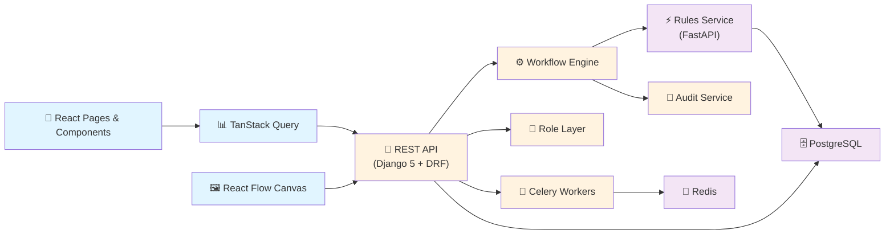
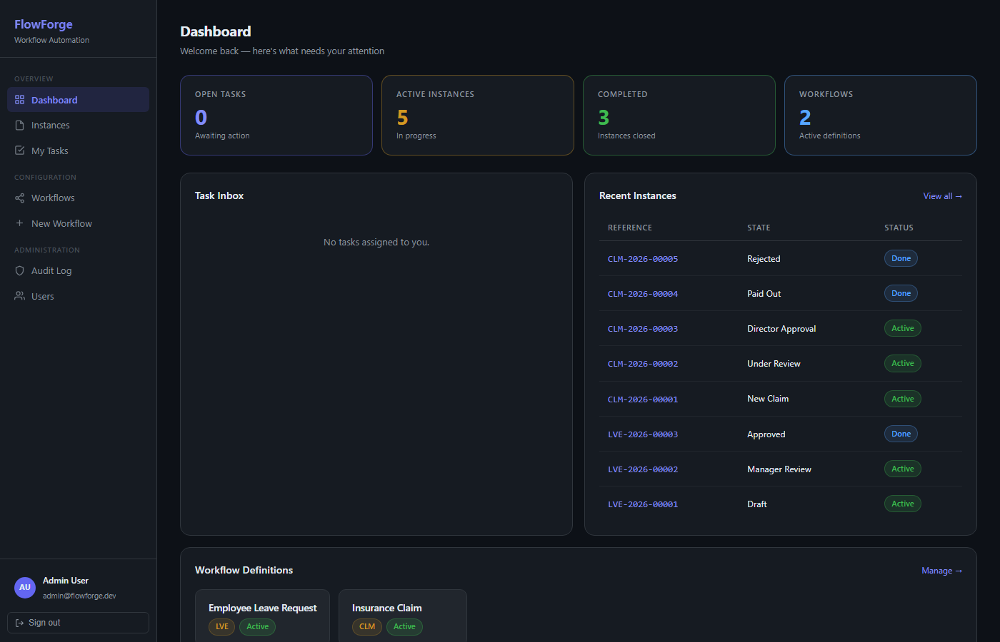
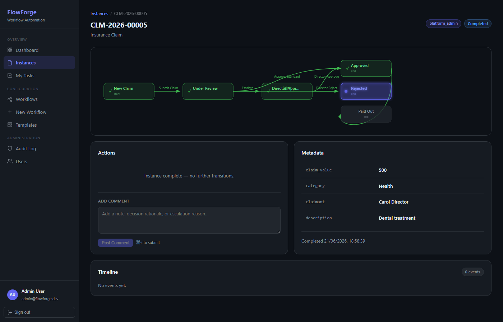
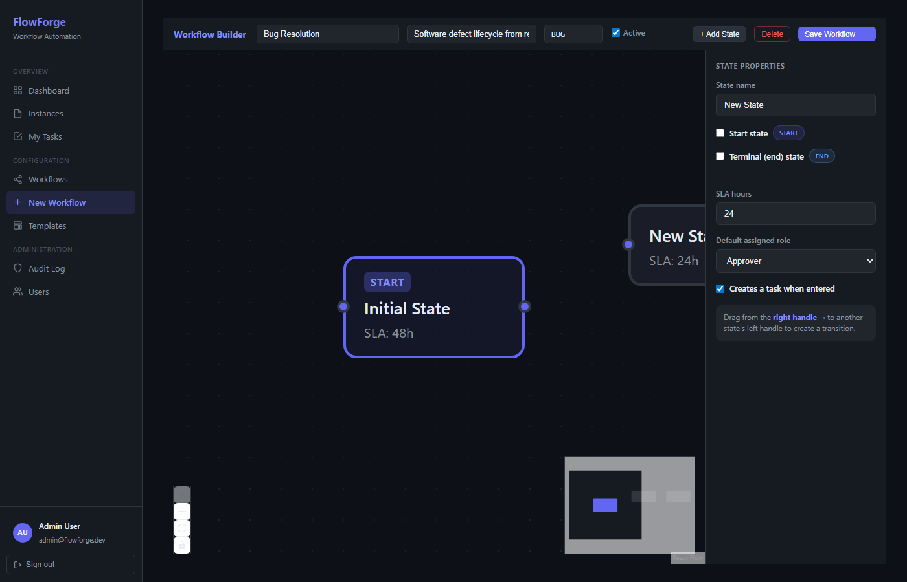
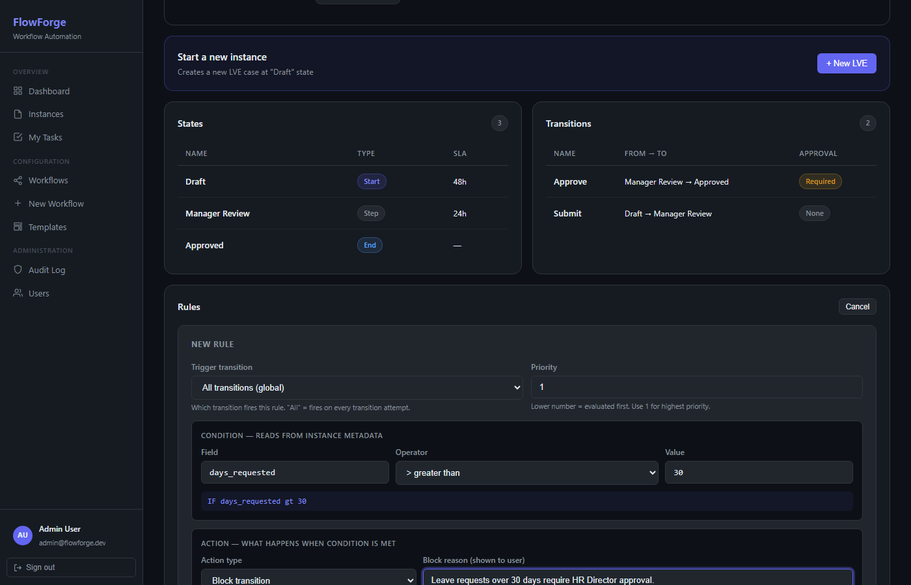
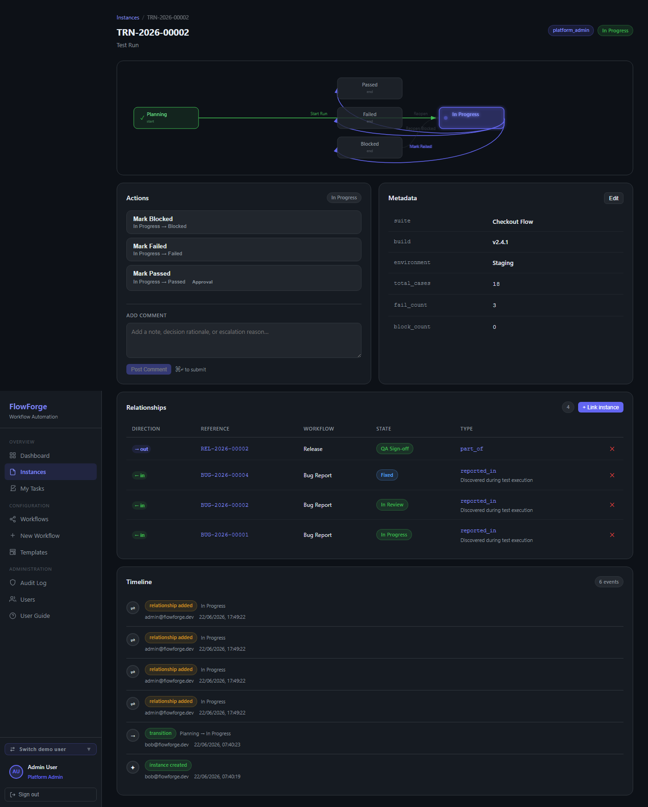
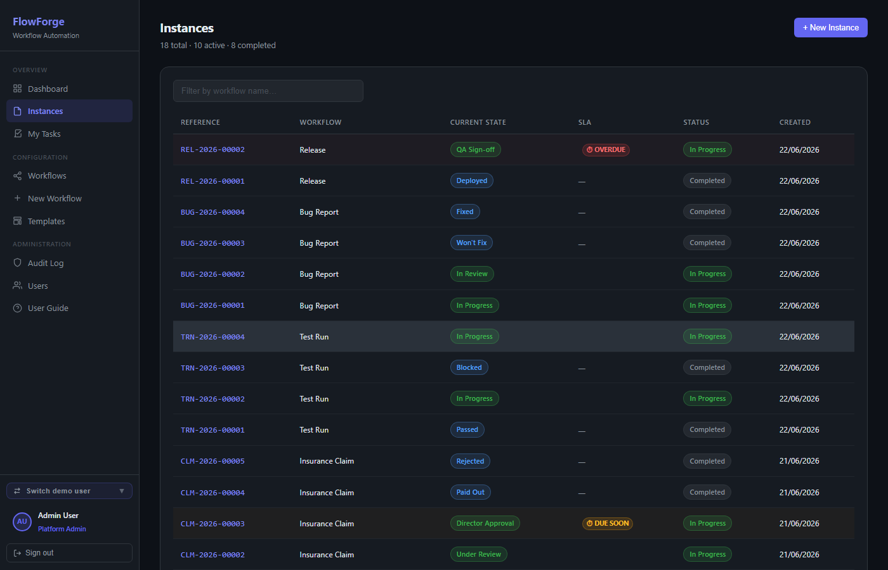

<!-- Badges -->
[](https://github.com/TestingCodings/FlowForge/actions/workflows/ci.yml)
[](LICENSE)
[](https://www.python.org/)
[](https://www.typescriptlang.org/)

# FlowForge

FlowForge is a configurable workflow automation platform that lets teams define any business process as states, transitions, and rules through a visual UI with no code changes required. The same engine drives an insurance claims assessment, a software release pipeline, a TestRail-style test run tracker, or any other multi-step approval process. Every action is captured in an immutable audit trail, roles gate every transition at the API layer, and SLA timers surface overdue work before it becomes a problem.

---

## Architecture



**Request path:** the React frontend talks exclusively to the Django REST API over JWT-authenticated requests. When a transition fires, the workflow engine evaluates any blocking rules by calling the FastAPI rules microservice (with a local Python fallback when the service is not running). Every state change, comment, and metadata edit is written to the immutable audit log. Celery handles async work such as notification delivery.

---

## Tech Stack

| Layer | Technology |
|---|---|
| Backend API | Django 5.0 + Django REST Framework |
| Authentication | JWT via `djangorestframework-simplejwt` |
| Rule engine | FastAPI microservice (Python fallback built in) |
| Task queue | Celery + Redis |
| Database | PostgreSQL (production) / SQLite (local dev, no Docker needed) |
| Frontend | React 18 + TypeScript + Vite |
| Server state | TanStack Query (react-query v5) |
| Workflow canvas | `@xyflow/react` (React Flow v12) |
| Charts | Recharts |
| Routing | react-router-dom v6 |
| CI | GitHub Actions |

---

## Features

| Feature | Detail |
|---|---|
| Visual Workflow Builder | Drag-and-drop canvas: draw states, connect transitions, set SLA hours and role requirements, save to the API |
| Rule Engine | Per-workflow rules with 10 operators (`gt`, `lt`, `eq`, `contains`, `is_true` ...) that block transitions or auto-assign roles based on live instance metadata |
| State Graph | BFS-topological SVG diagram on every instance: green = path taken, grey = branch not reached, indigo pulse = current state |
| Relationship Fields | Directional typed links between instances (`reported_in`, `blocks`, `part_of` ...) with debounced search picker and audit on both ends |
| State Forms | Attach a typed, validated form to any state; required forms block transitions until submitted; values merge into metadata for rule evaluation; visual form editor |
| SLA Breach Indicators | Amber/red badges on overdue instances; tinted rows in the table; `check_slas` command records breaches to the audit trail and notifies subscribers, once per state entry |
| Webhooks | Per-workflow or global HTTP subscriptions with event filters; JSON payloads signed with HMAC-SHA256 (`X-FlowForge-Signature`); pause/resume and delivery log |
| Workflow Versioning | Publish a new version from any workflow; deep-clones all states, transitions, and rules as a draft; version history panel |
| Role-Based Access | Five roles (`viewer` to `platform_admin`); enforced server-side on every API action, not just the UI |
| Audit Trail / Timeline | Immutable log of every event rendered as a vertical timeline with actor, timestamp, and state delta |
| Metadata Editor | Add/edit key-value fields on any live instance; values auto-coerced to number/boolean/string |
| Dashboard Charts | Activity area chart (14 days), instances-by-state bar, active/completed stacked bar by workflow |
| Bulk Operations | Select up to 100 instances: fire one transition across all with per-instance results, or export the selection (with flattened metadata columns) as CSV |
| Instance Containers | Nest instances inside instances (Release contains Test Runs contains Bug Reports): per-workflow allow-lists, roll-up progress on the parent, breadcrumb navigation, and rules that gate parent transitions until children complete |
| Workspace Theming | White-label the platform: name, tagline, logo, four theme presets (incl. light mode), 15 colour tokens, font, and date format - edited live with instant preview (Layer 1) |
| UI Shells | Present any workflow as a list, kanban board (drag-to-transition), sortable table, or calendar - configured visually per workflow with per-state colours; every shell defers to the engine so rules, approvals, and forms gate every move (Layer 2) |
| Export / Import | Download any workflow as a portable `.flowforge.json` bundle (states, transitions, rules, forms, UI schema, name-based references) and import it on any FlowForge install (Layer 3 foundation) |
| Demo User Switcher | Flip between admin/approver/participant in one browser tab to demonstrate role differences live |
| Seed Command | `python manage.py seed --reset` - idempotent demo data with full audit trails; `--testrail` adds a three-workflow test management suite |

---

## Screenshots

| | |
|---|---|
|  |  |
| **Dashboard with live charts** | **Instance with state graph + timeline** |
|  |  |
| **Visual Workflow Builder** | **Inline Rule Builder** |
|  |  |
| **Instance Relationships panel** | **SLA breach indicators** |

---

## Local Setup

### Prerequisites

- Python 3.11+
- Node.js 18+

No Docker required for local development. SQLite is used by default.

### 1. Backend

```bash
cd backend
python -m venv venv

# Windows
venv\Scripts\activate
# macOS / Linux
source venv/bin/activate

pip install -r requirements.txt

# Run migrations and seed demo data
python manage.py migrate --settings=config.settings.local_sqlite
python manage.py seed   --settings=config.settings.local_sqlite

# Start the API server (port 8000)
python manage.py runserver --settings=config.settings.local_sqlite
```

The seed command prints all demo credentials to your terminal on completion.

### 2. Frontend

```bash
cd frontend
npm install
npm run dev     # Vite dev server at http://localhost:5173
```

### 3. Rules microservice (optional)

```bash
cd rules-service
pip install -r requirements.txt
uvicorn main:app --port 8001
```

If the microservice is not running the backend falls back to the built-in Python evaluator automatically. All rule features still work.

---

## Demo Walkthrough (5 minutes)

1. Log in with the `platform_admin` credentials printed by `seed`
2. Open **Workflows > Insurance Claim** and inspect the state graph and the blocking rule
3. Click **+ New CLM** to create a fresh instance
4. In the Metadata panel click **Edit** and add `claim_value = 15000`
5. Try **Approve Standard**: the rule blocks it with a configured message
6. Click **Escalate**, then **Director Approve** to resolve the claim
7. Add a comment at any step; it appears in the Timeline with actor and timestamp
8. Use **Switch demo user** in the sidebar to become the `participant` account and observe that approval transitions are grayed out

### TestRail-style demo

```bash
python manage.py seed --testrail --settings=config.settings.local_sqlite
```

Seeds three linked workflows (Test Run, Bug Report, Release) with pre-populated relationships across instances. Open any `TRN-` instance to see the Relationships panel showing the linked `BUG-` reports and the `REL-` they are blocking.

---

## Project Structure

```
FlowForge/
├── backend/
│   ├── apps/
│   │   ├── accounts/       # Users, roles, JWT auth, permission layer
│   │   ├── audit/          # Immutable audit log and service helpers
│   │   ├── instances/      # Workflow instances, transitions, relationships
│   │   ├── notifications/  # Notification templates and delivery log
│   │   ├── tasks/          # Per-state task assignment
│   │   └── workflows/      # Definitions, states, transitions, rules, engine
│   └── config/settings/
│       ├── base.py
│       ├── local.py        # CI / PostgreSQL settings
│       └── local_sqlite.py # No-Docker local dev settings
├── frontend/
│   └── src/
│       ├── components/     # AppLayout, StateGraph, ProtectedRoute
│       ├── pages/          # One file per route
│       ├── api/            # Axios client with JWT interceptors
│       └── types/          # Shared TypeScript interfaces
├── rules-service/          # FastAPI rule evaluation microservice
├── docs/
│   ├── VISION.md           # Platform architecture and three-layer roadmap
│   └── screenshots/
└── .github/workflows/ci.yml
```

---

## Roles and Capabilities

| Role | Comment | Transition | Approve | Design Workflows | Admin |
|---|---|---|---|---|---|
| viewer | Yes | | | | |
| participant | Yes | Yes | | | |
| approver | Yes | Yes | Yes | | |
| workflow_designer | Yes | Yes | Yes | Yes | |
| platform_admin | Yes | Yes | Yes | Yes | Yes |

All role checks are enforced server-side in `apps/accounts/permissions.py`. Frontend gating is a UX convenience layer only.

---

## Roadmap

The project is built in deliberate phases, each shipping a complete vertical slice before the next begins.

| Phase | Scope | Status |
|---|---|---|
| 1 | Core engine: states, transitions, rules, JWT auth, audit log | Done |
| 2 | Visual workflow builder (React Flow canvas), inline rule editor | Done |
| 3 | Dashboard analytics, seed workflows, user guide | Done |
| 4 | API-layer role enforcement, SLA indicators, workflow versioning, instance relationships | Done |
| 5 | Form schemas per state: structured data collection gating transitions, visual form editor | Done |
| 6 | Webhooks (HMAC-signed), event notifications, scheduled SLA breach enforcement | Done |
| 7 | Bulk operations: multi-select transition with per-instance results, CSV export | Done |
| 8 | Layer 1 complete: white-labelling with presets, light mode, fonts, date formats | Done |
| 9 | Layer 2 complete: shell architecture (kanban, table, calendar), visual UI schema builder, per-state colours | Done |
| 10 | Layer 3 foundation: portable workflow bundles (export/import as JSON) | Done |
| 11 | Instance containers: sub-instances with allow-lists, roll-up progress, hierarchy-aware rules | Done |
| 12 | Layer 3: Docker Compose + PostgreSQL production setup, embedded widget, full app export | Planned |

See [docs/VISION.md](docs/VISION.md) for the platform architecture vision, [docs/ENHANCEMENT.md](docs/ENHANCEMENT.md) for strengthening phases 1–11, [docs/UX.md](docs/UX.md) for the usability roadmap, and [docs/API.md](docs/API.md) for the complete API reference.

---

## License

[Business Source License 1.1](LICENSE) — source-available.

- **Free** for evaluation, personal, educational, and research use, and for
  internal business use within your own organisation (including running your
  own processes in production).
- **Requires a commercial licence** only to offer FlowForge, or a derivative,
  to third parties as a competing hosted service or commercial product.
- **Converts to Apache 2.0** on 2030-07-21.

Versions up to commit `633def5` were released under the MIT License and remain
available under those terms in the git history.
