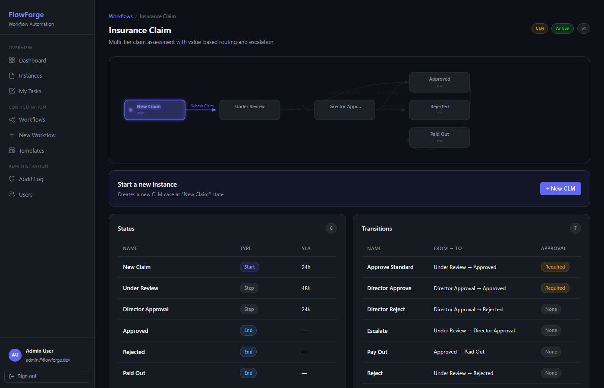

# FlowForge

A configurable workflow automation platform built as a portfolio project. Define business processes as states, transitions, and rules through a visual UI — no code changes required. The same engine drives an insurance claims assessment, an HR leave approval, or any other multi-step process.


---

## Features

| Feature | Detail |
|---|---|
| **Visual Workflow Builder** | Drag-and-drop canvas (React Flow) — draw states, connect them with transitions, set SLA hours and roles, save to API |
| **Rule Engine** | Per-workflow rules with 10 operators (gt, lt, eq, contains, is_true …) that block transitions or assign roles based on live instance metadata |
| **State Graph** | BFS-topological SVG diagram on every instance — green = path actually taken, grey = branch not reached, indigo pulse = current state |
| **Metadata Editor** | Add/edit/delete key-value fields on any live instance; values auto-coerced to number/boolean/string; every edit logged to the audit trail |
| **Comments** | Inline comment box on every instance; appears in the timeline with actor and timestamp; all roles can comment |
| **Role-based UI** | Five roles (viewer → platform_admin); approval-only transitions are gated and shown grayed-out to lower roles |
| **Audit Trail / Timeline** | Immutable log of every event (created, transition, rule fired, comment, metadata update) displayed as a vertical timeline |
| **Inline Rule Builder** | Condition preview (`IF claim_value gt 10000`), action preview, operator reference — all on the Workflow Detail page |
| **Users Page** | Manage user roles inline; role legend with capability matrix |
| **User Guide** | In-app help page with 5-minute walkthrough, operator reference, FAQ |
| **Dashboard Charts** | Activity area chart (created vs completed, last 14 days), instances-by-state horizontal bar, active/completed stacked bar by workflow |
| **Seed Command** | `python manage.py seed --reset` — idempotent demo data with full audit trails; add `--testrail` for the test-management workflow set |

---

## Screenshots

| | |
|---|---|
|  |  |
| **Visual Workflow Builder** | **Inline Rule Builder** |
|  |  |
| **Instance with state graph + timeline** | **Workflow detail with states & transitions** |

---

## Tech Stack

| Layer | Technology |
|---|---|
| Backend | Django 5.0 + Django REST Framework |
| Auth | JWT via `djangorestframework-simplejwt` |
| Rule Engine | FastAPI microservice (optional — falls back to local Python engine) |
| Database | SQLite (local dev) / PostgreSQL (production-ready) |
| Frontend | React 18 + TypeScript + Vite |
| State management | TanStack Query (react-query) |
| Workflow canvas | `@xyflow/react` (React Flow v12) |
| Forms | react-hook-form |
| Routing | react-router-dom v6 |

---

## Local Development (no Docker required)

### Prerequisites

- Python 3.11+
- Node.js 18+

### 1 — Backend

```bash
cd backend
python -m venv venv
# Windows:
venv\Scripts\activate
# macOS/Linux:
source venv/bin/activate

pip install -r requirements.txt

# Run migrations and seed demo data
python manage.py migrate --settings=config.settings.local_sqlite
python manage.py seed   --settings=config.settings.local_sqlite

# Start the API server (port 8000)
python manage.py runserver --settings=config.settings.local_sqlite
```

### 2 — Frontend

```bash
cd frontend
npm install
npm run dev          # Vite dev server on http://localhost:5173
```

### 3 — Rules microservice (optional)

```bash
cd rules-service
pip install -r requirements.txt
uvicorn main:app --port 8001
```

If the rules service is not running, the backend automatically falls back to the built-in Python rule evaluator — all rule features still work.

---

## Demo Credentials

Run the seed command — it prints all credentials on completion:

```bash
python manage.py seed --settings=config.settings.local_sqlite
```

Four demo users are created across the role spectrum (platform_admin, approver, participant). Credentials are intentionally not published here.

---

## Demo Workflows

### Employee Leave Request (LVE)
3 states · 2 transitions · linear flow

```
Draft → [Submit] → Manager Review → [Approve*] → Approved
```
`*` requires approver role

### Test Management (TRN / BUG / REL) — `--testrail`

Three linked workflows that turn FlowForge into a TestRail replacement:

- **Test Run (TRN)** — plan → in progress → passed/failed/blocked. Rules block "Mark Passed" if `fail_count > 0` or `block_count > 0`
- **Bug Report (BUG)** — new → in progress → in review → fixed/won't fix/duplicate. Cross-referenced to the failing test run via `reported_in` metadata
- **Release (REL)** — draft → QA sign-off → approved → deployed/rolled back. Rules block QA sign-off if `open_critical_bugs > 0` or `failing_runs > 0`

```bash
python manage.py seed --testrail --settings=config.settings.local_sqlite
```

---

### Insurance Claim (CLM)
6 states · 7 transitions · branching with value-based escalation rule

```
New Claim → [Submit Claim] → Under Review ──[Approve Standard*]──→ Approved → [Pay Out] → Paid Out
                                          └──[Escalate]──→ Director Approval ──[Director Approve*]──→ Approved
                                          └──[Reject]────→ Rejected           └──[Director Reject]──→ Rejected
```

**Rule:** `IF claim_value > 10000 THEN block "Approve Standard"` with message _"Claims over £10,000 require Director approval. Use Escalate instead."_

---

## 5-Minute Interactive Demo

1. Log in with the platform_admin account printed by the seed command
2. Open **Workflows → Insurance Claim** — inspect the state graph and the blocking rule
3. Click **+ New CLM** to create a fresh instance
4. On the instance page, click **Edit** in the Metadata panel and add `claim_value = 15000`
5. Try **Approve Standard** — the rule blocks it with the configured message
6. Click **Escalate** → then **Director Approve** to resolve the claim
7. Add a comment at any point — it appears in the Timeline
8. Log in as the participant account — the approval transitions are grayed out

---

## Project Structure

```
FlowForge/
├── backend/
│   ├── apps/
│   │   ├── accounts/      # Users, roles, JWT auth
│   │   ├── audit/         # Immutable audit log
│   │   ├── instances/     # Workflow instances, transitions, comments, metadata
│   │   ├── notifications/ # Notification templates and logs
│   │   ├── tasks/         # Task assignment per state
│   │   └── workflows/     # Workflow definitions, states, transitions, rules, engine
│   └── config/
│       └── settings/
│           └── local_sqlite.py   # No-Docker dev settings
├── frontend/
│   └── src/
│       ├── components/    # AppLayout, StateGraph, ProtectedRoute
│       ├── pages/         # One file per route
│       ├── api/           # Axios client with JWT interceptors
│       └── types/         # TypeScript interfaces
├── rules-service/         # FastAPI rule evaluation microservice
└── docs/screenshots/      # UI screenshots
```

---

## Roles & Capabilities

| Role | Comment | Transition | Approve | Admin |
|---|---|---|---|---|
| viewer | ✓ | — | — | — |
| participant | ✓ | ✓ | — | — |
| approver | ✓ | ✓ | ✓ | — |
| workflow_designer | ✓ | ✓ | ✓ | Workflows |
| platform_admin | ✓ | ✓ | ✓ | ✓ |

---

## Roadmap

- [x] Dashboard analytics charts (instances by state, completion rate over time)
- [ ] Multi-user demo switcher in the header
- [ ] SLA breach indicators on overdue instances
- [ ] Workflow versioning — publish new versions, migrate open instances
- [ ] PostgreSQL + Docker Compose production setup
- [ ] Role enforcement at the API layer (currently frontend-only)
