<!-- Badges -->
[](https://github.com/TestingCodings/FlowForge/actions/workflows/ci.yml)
[](LICENSE)
[](https://www.python.org/)
[](https://www.typescriptlang.org/)

# FlowForge

FlowForge is a configurable workflow automation platform that lets teams define any business process as states, transitions, and rules through a visual UI with no code changes required. The same engine drives an insurance claims assessment, a software release pipeline, a TestRail-style test run tracker, or any other multi-step approval process. Every action is captured in an immutable audit trail, roles gate every transition at the API layer, and SLA timers surface overdue work before it becomes a problem.

## Highlights

- **Model any process, no code** - states, transitions, and a rules engine, authored on a visual React Flow canvas *or* as diffable YAML with a live preview.
- **Seven presentation shells** - the same workflow renders as a list, kanban board (drag-to-transition), table, calendar, TestRail-style matrix, Typeform-style stepped form, or a visual-novel scene player, chosen per workflow via `ui_schema`.
- **White-labelling** - theme presets, light/dark, fonts, date formats, density, and i18n (English, Spanish, French, German) per workspace.
- **Structured data** - per-state forms that gate transitions and feed the rules engine; instance containers (workflows nesting workflows) with roll-up progress; computed fields that derive values across children *and* relationships.
- **Files and images** - uploads with server-side magic-byte type checking, EXIF stripped by re-encoding, UUID storage keys, and authenticated downloads (asset URLs are never public).
- **Governance** - five-tier RBAC enforced at the API layer, an immutable audit trail, and scheduled SLA-breach enforcement.
- **Integrations, both directions** - HMAC-signed outbound webhooks, inbound triggers (external systems create instances or fire transitions through a secret URL), and action hooks that call external systems *before* a transition (gating it on the response) or after it commits - all with an encrypted secret store and an SSRF guard.
- **Agent-ready** - an MCP server exposing ten tools, so an AI assistant can read workflows, author them from YAML, and drive instances.
- **System map** - a cross-workflow topology view of how instances actually connect, exportable as a PNG.
- **Production-hardened** - async delivery with retries, optimistic locking (`If-Match`/409), form-schema versioning, a rules-service circuit breaker, and a Playwright + 338-test backend suite gating CI.

---

## Architecture

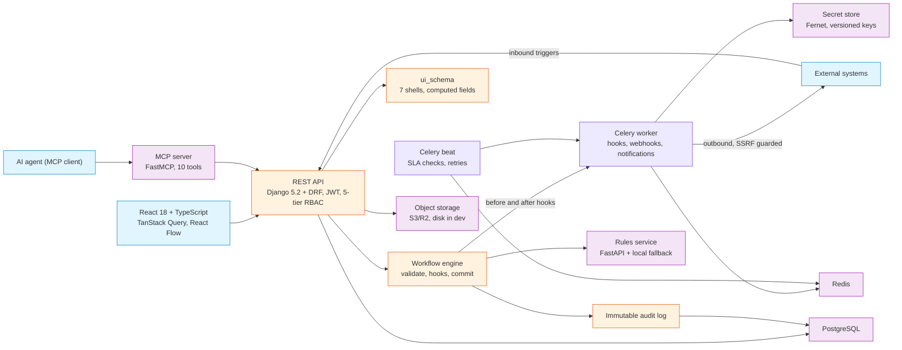
```mermaid
graph LR
    UI["React 18 + TypeScript<br/>TanStack Query, React Flow"]
    Agent["AI agent (MCP client)"]
    Ext["External systems"]

    MCP["MCP server<br/>FastMCP, 10 tools"]
    API["REST API<br/>Django 5.2 + DRF, JWT, 5-tier RBAC"]
    Engine["Workflow engine<br/>validate, hooks, commit"]
    Shells["ui_schema<br/>7 shells, computed fields"]
    Audit["Immutable audit log"]

    Worker["Celery worker<br/>hooks, webhooks, notifications"]
    Beat["Celery beat<br/>SLA checks, retries"]

    RulesMS["Rules service<br/>FastAPI + local fallback"]
    Secrets["Secret store<br/>Fernet, versioned keys"]
    PG["PostgreSQL"]
    Redis["Redis"]
    Blob["Object storage<br/>S3/R2, disk in dev"]

    UI --> API
    Agent --> MCP
    MCP --> API
    Ext -->|inbound triggers| API

    API --> Engine
    API --> Shells
    API --> PG
    API --> Blob

    Engine -->|before and after hooks| Worker
    Engine --> RulesMS
    Engine --> Audit
    Audit --> PG

    Worker -->|outbound, SSRF guarded| Ext
    Worker --> Secrets
    Worker --> Redis
    Beat --> Worker
    Beat --> Redis

    classDef client fill:#e1f5ff,stroke:#0284c7
    classDef backend fill:#fff3e0,stroke:#ea580c
    classDef queue fill:#ede9fe,stroke:#7c3aed
    classDef store fill:#f3e5f5,stroke:#a21caf

    class UI,Agent,Ext client
    class API,Engine,Shells,Audit backend
    class Worker,Beat queue
    class MCP,RulesMS,PG,Redis,Blob,Secrets store
```

**Request path.** The React frontend talks exclusively to the Django REST API over JWT-authenticated requests; an MCP client reaches the same API through the MCP server, so agents get no privileged back door.

**Transition path** — the one flow worth understanding, because everything else composes onto it:

1. **Validate** — the transition must be legal from the current state, any required form must be submitted, and rules are evaluated (via the FastAPI rules service, falling back to local Python behind a circuit breaker when it's unavailable). A rule can block with a human-readable reason.
2. **`before` hooks** run *outside* the transaction — they may call external systems, so holding a DB transaction open across a network call would be a mistake. A failing hook can abort the transition.
3. **Commit** — atomically, re-checking under `select_for_update` that the instance hasn't moved since validation, so a concurrent transition can't be clobbered. Rule `set_metadata` values and hook outputs merge into the instance here.
4. **`after` hooks, webhooks, notifications** are queued to Celery post-commit, with retries and a delivery log.

Every state change, comment, and metadata edit lands in the immutable audit log. Outbound calls of every kind pass a shared SSRF guard that rejects private, loopback, and link-local addresses.

---

## Tech Stack

| Layer | Technology |
|---|---|
| Backend API | Django 5.2 LTS + Django REST Framework 3.16 |
| Authentication | JWT via `djangorestframework-simplejwt` |
| Rule engine | FastAPI microservice (local Python fallback + circuit breaker) |
| Task queue | Celery 5.4 + Redis (worker for hooks/webhooks, beat for SLAs) |
| Database | PostgreSQL (production) / SQLite (local dev, no Docker needed) |
| Encryption | `cryptography` (Fernet, versioned keys) for the secret store |
| Media | Pillow (magic-byte sniffing + EXIF-stripping re-encode); `django-storages` → S3/R2 in production |
| Agent interface | MCP server (`FastMCP`) exposing 10 tools |
| Frontend | React 18 + TypeScript 5 + Vite 5 |
| Server state | TanStack Query (react-query v5) |
| Workflow canvas | `@xyflow/react` (React Flow v12) + dagre auto-layout |
| Charts | Recharts |
| Routing | react-router-dom v6 |
| Testing | pytest-django (338 tests) + Playwright with playwright-bdd (Gherkin) |
| CI | GitHub Actions (tests, typecheck, E2E, dependency audit) |
| Deployment | Docker Compose + Caddy (automatic TLS) |

---

## Features

| Feature | Detail |
|---|---|
| Visual Workflow Builder | Drag-and-drop canvas: draw states, connect transitions, set SLA hours and role requirements, save to the API |
| Rule Engine | Per-workflow rules with 10 operators (`gt`, `lt`, `eq`, `contains`, `is_true` ...) evaluated against live instance metadata **plus injected hierarchy facts** (`children_total`, `children_open`, `children_complete`). Actions: `block_transition` (with a human-readable reason surfaced in the UI), `assign_role`, and `set_metadata` to stamp values onto the instance as part of the transition |
| State Graph | BFS-topological SVG diagram on every instance: green = path taken, grey = branch not reached, indigo pulse = current state |
| Relationship Fields | Directional typed links between instances (`reported_in`, `blocks`, `part_of` ...) with debounced search picker and audit on both ends |
| State Forms | Attach a typed, validated form to any state; required forms block transitions until submitted; values merge into metadata for rule evaluation; visual form editor |
| SLA Breach Indicators | Amber/red badges on overdue instances; tinted rows in the table; `check_slas` command records breaches to the audit trail and notifies subscribers, once per state entry |
| Webhooks | Per-workflow or global HTTP subscriptions with event filters; JSON payloads signed with HMAC-SHA256 (`X-FlowForge-Signature`); pause/resume and delivery log |
| Workflow Versioning | Publish a new version from any workflow; deep-clones all states, transitions, and rules as a draft; version history panel |
| Role-Based Access | Five roles (`viewer` to `platform_admin`); enforced server-side on every API action, not just the UI |
| Audit Trail / Timeline | Immutable log of every event rendered as a vertical timeline with actor, timestamp, and state delta |
| Metadata Editor | Add/edit key-value fields on any live instance; values auto-coerced to number/boolean/string |
| Dashboard Charts | Activity area chart (14 days), instances-by-state bar, active/completed stacked bar by workflow |
| Bulk Operations | Select up to 100 instances: fire one transition across all with per-instance results, or export the selection (with flattened metadata columns) as CSV |
| Instance Containers | Nest instances inside instances (Release contains Test Runs contains Bug Reports): per-workflow allow-lists, roll-up progress on the parent, breadcrumb navigation, and rules that gate parent transitions until children complete |
| Workspace Theming | White-label the platform: name, tagline, logo, four theme presets (incl. light mode), 15 colour tokens, font, and date format - edited live with instant preview (Layer 1) |
| UI Shells | Present any workflow as a list, kanban board (drag-to-transition), sortable table, calendar, TestRail-style matrix, Typeform-style stepped form, or visual-novel scene player - configured per workflow via `ui_schema` with per-state colours and icons; every shell defers to the engine, so rules, approvals, and forms gate every move (Layer 2) |
| File & Image Uploads | Attach files to any instance. Type is decided by **magic-byte sniffing** (a renamed executable is rejected), images are **re-encoded through Pillow** to strip EXIF and defuse polyglots, storage keys are UUIDs so a crafted filename can't shape the path, and the internal file path is never serialised - downloads route through an authenticated endpoint, never a bucket URL |
| Computed Fields | Read-only derived values defined in `ui_schema.computed`: rollups (`sum`/`min`/`max`/`avg`/`count`) over children **or typed relationships**, `age_days`, and `if` conditionals. Resolved at read time so they can't drift, rendered in shells via an opt-in `?include=computed` that prefetches to avoid N+1, and injected into the data rules see - so a rule can gate on a rollup |
| Action Hooks | Call external systems as part of a transition. `after` hooks fire post-commit (async, retried, can write the response back into metadata); `before` hooks run synchronously *ahead* of the state change and can **block** it - a health-check gate. Templating resolves `{{secret.NAME}}`, `{{metadata.key}}`, and instance fields; secrets are redacted from every log |
| Secret Store | Write-only encrypted credentials (`/api/secrets/`): values are never returned by the API, encrypted at rest with Fernet under **versioned keys** (rotatable without downtime), and fail closed when no key is configured |
| Inbound Triggers | External systems create instances or fire transitions through a secret URL, with per-trigger throttling - the inbound counterpart to webhooks |
| SSRF Guard | Every outbound call (webhooks, action hooks, probes) resolves the target and refuses private, loopback, and link-local addresses, with an optional host allow-list |
| Topology View | A cross-workflow map of how instances actually connect - parent/child containment plus typed relationships - focusable on any instance and exportable as a PNG |
| Optimistic Locking | Metadata edits carry `If-Match`; a stale write gets a 409 instead of silently clobbering a concurrent edit |
| i18n | English, Spanish, French, and German catalogues with `{placeholder}` interpolation and en-GB fallback, so partial translations stay safe |
| MCP Server | Ten tools (`list_workflows`, `get_workflow`, `list_instances`, `get_instance`, `search_instances`, `get_topology`, `validate_workflow_yaml`, `create_workflow_from_yaml`, `create_instance`, `fire_transition`) letting an AI agent read, author, and drive workflows through the same authenticated API - no privileged back door |
| Export / Import | Download any workflow as a portable `.flowforge.json` bundle (states, transitions, rules, forms, UI schema, name-based references) and import it on any FlowForge install (Layer 3 foundation) |
| Demo User Switcher | Flip between admin/approver/participant in one browser tab to demonstrate role differences live |
| Seed Commands | `python manage.py seed --reset` - idempotent demo data with full audit trails; `--testrail` adds a three-workflow test-management suite; `seed_demo_story` adds a two-ending branching story for the scene shell |

---

## Screenshots

| | |
|---|---|
| 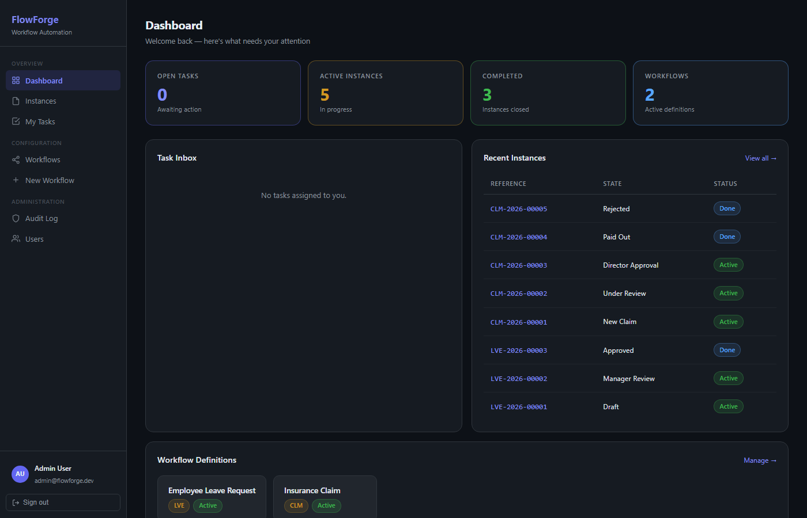 | 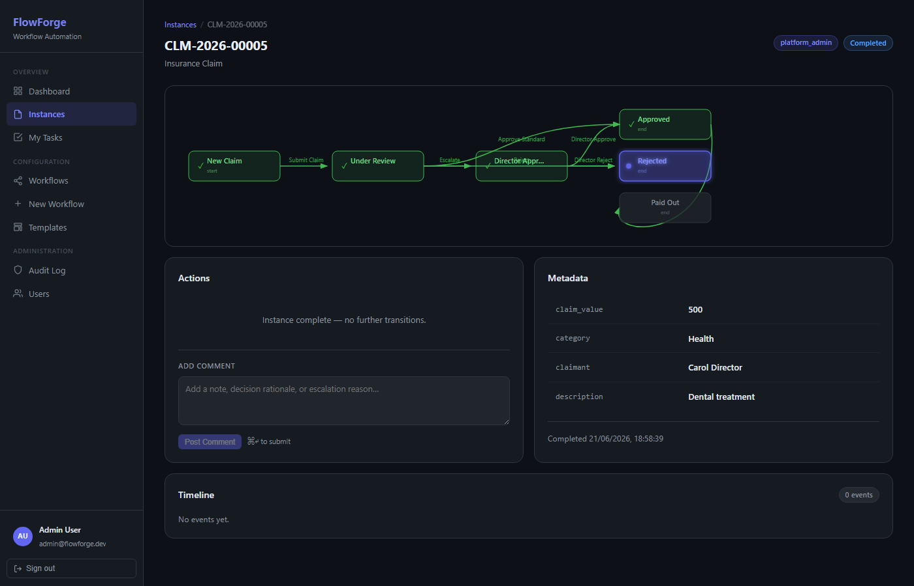 |
| **Dashboard with live charts** | **Instance with state graph + timeline** |
| 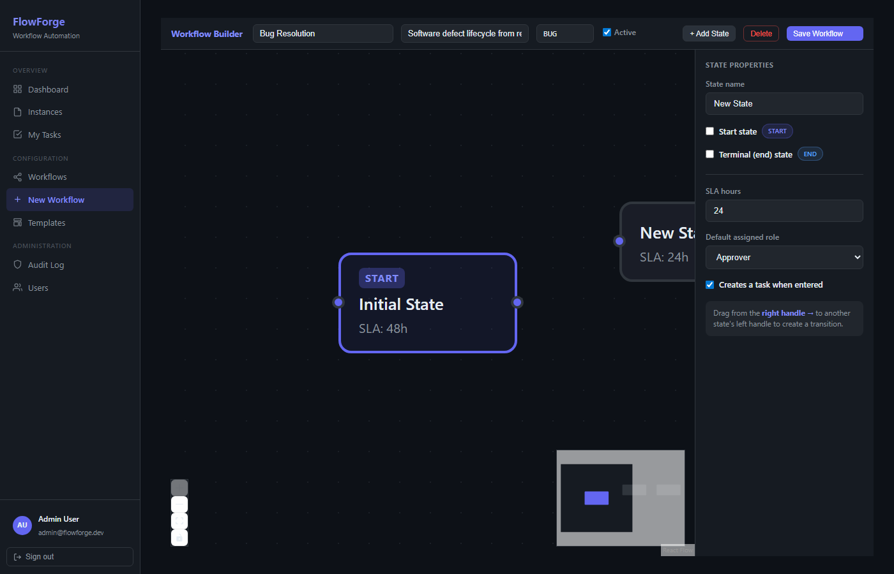 | 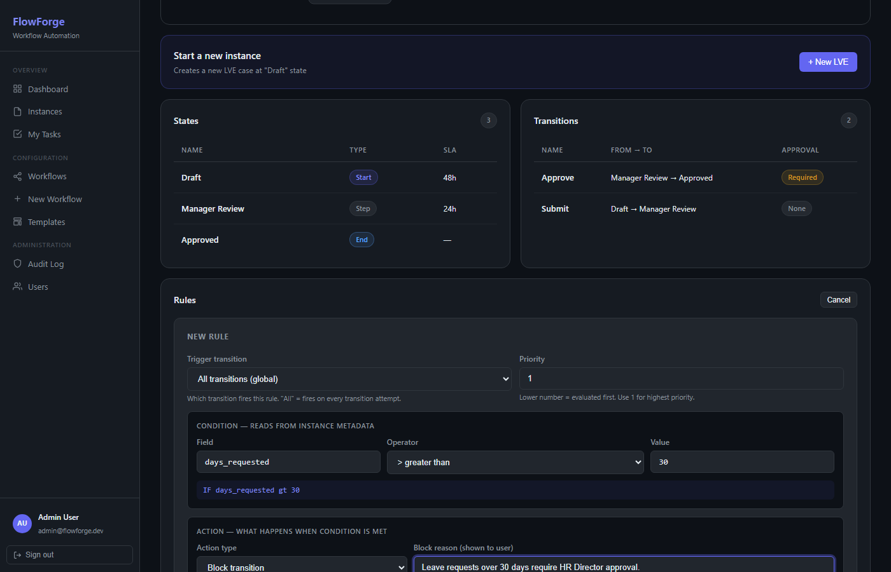 |
| **Visual Workflow Builder** | **Inline Rule Builder** |
| 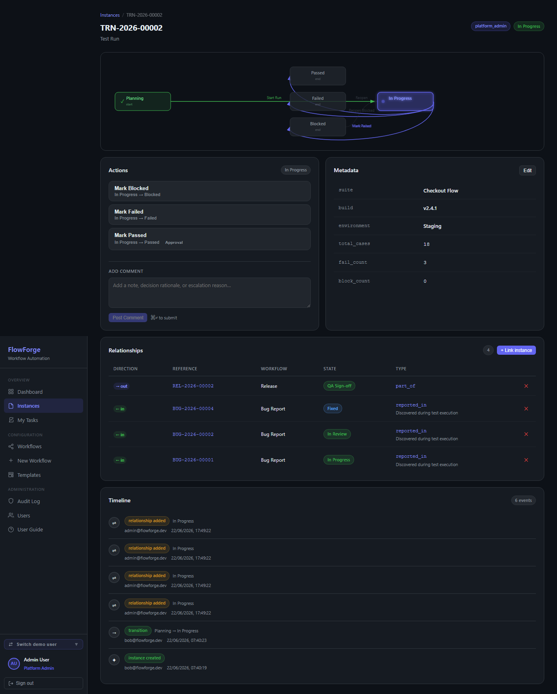 | 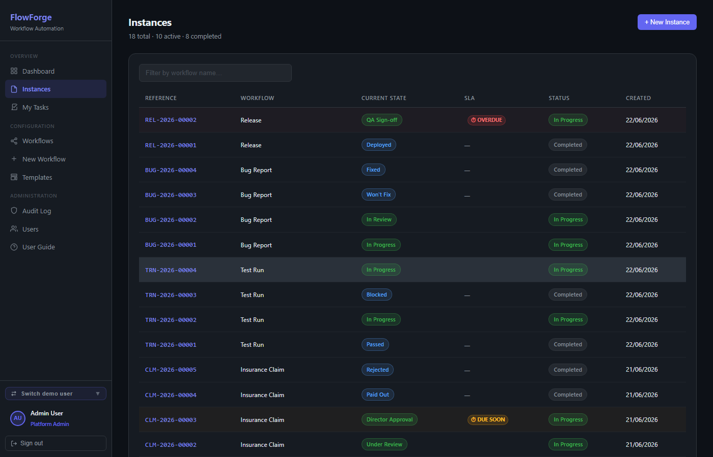 |
| **Instance Relationships panel** | **SLA breach indicators** |
| 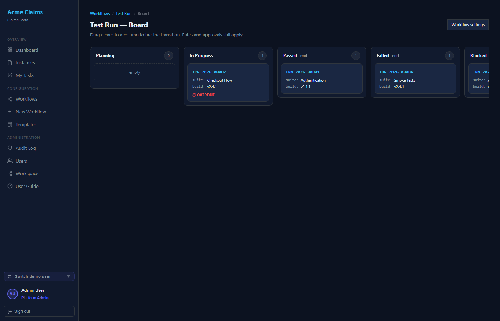 | 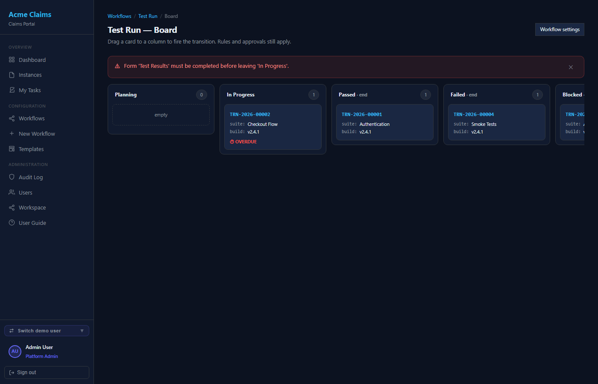 |
| **Kanban shell — drag to transition** | **A rule refusing the move, with its reason** |
| 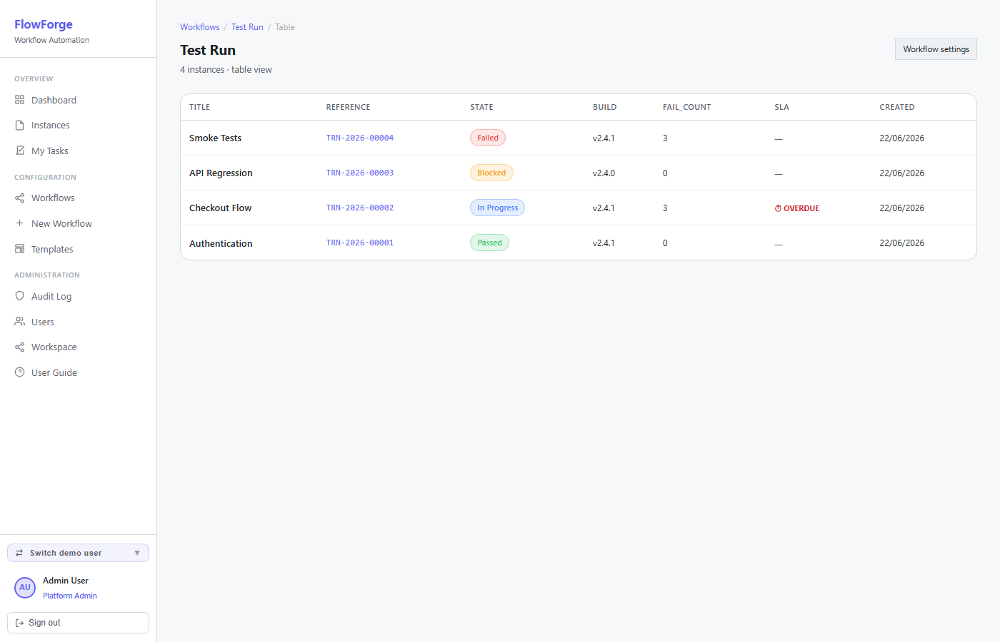 | 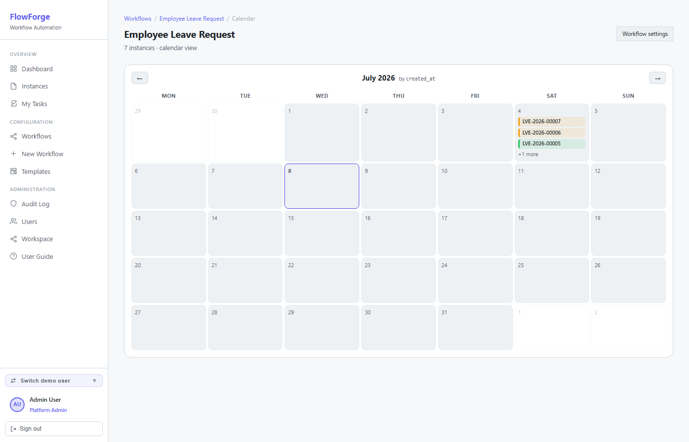 |
| **Table shell with metadata columns** | **Calendar shell** |
| 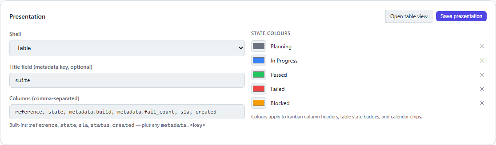 | 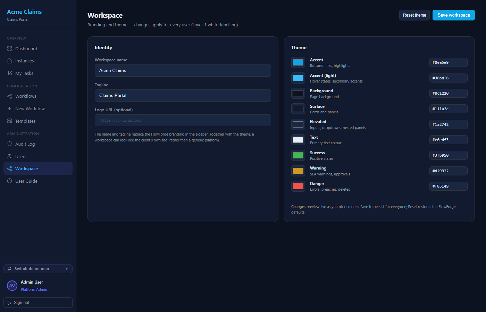 |
| **Choosing a shell per workflow (`ui_schema`)** | **White-label theming, live preview** |
| 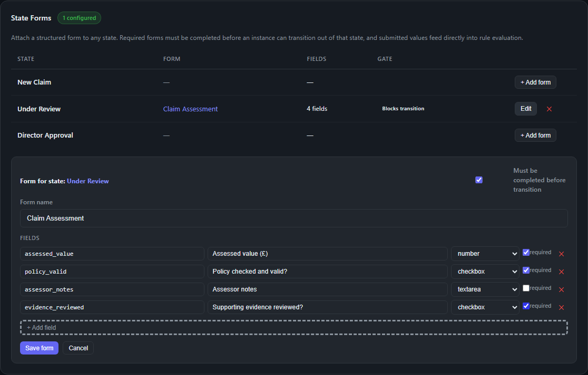 | 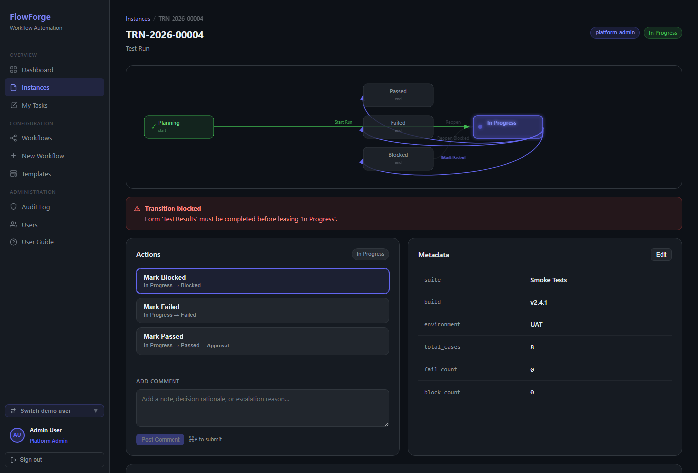 |
| **Visual form editor** | **A required form gating a transition** |
| 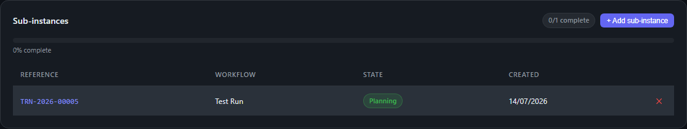 | 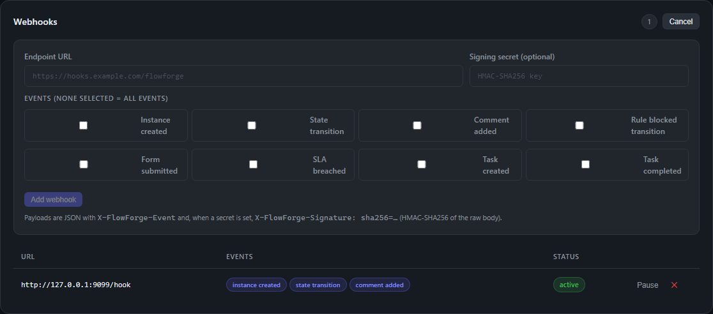 |
| **Instance containers with roll-up** | **Webhook subscriptions + delivery log** |

---

## Local Setup

### Prerequisites

- Python 3.11+
- Node.js 18+

No Docker required for local development. SQLite is used by default.

### 1. Backend

```bash
cd backend
python -m venv venv

# Windows
venv\Scripts\activate
# macOS / Linux
source venv/bin/activate

pip install -r requirements.txt

# Run migrations and seed demo data
python manage.py migrate --settings=config.settings.local_sqlite
python manage.py seed   --settings=config.settings.local_sqlite

# Start the API server (port 8000)
python manage.py runserver --settings=config.settings.local_sqlite
```

The seed command prints all demo credentials to your terminal on completion.

### 2. Frontend

```bash
cd frontend
npm install
npm run dev     # Vite dev server at http://localhost:5173
```

### 3. Rules microservice (optional)

```bash
cd rules-service
pip install -r requirements.txt
uvicorn main:app --port 8001
```

If the microservice is not running the backend falls back to the built-in Python evaluator automatically. All rule features still work.

---

## Demo Walkthrough (5 minutes)

1. Log in with the `platform_admin` credentials printed by `seed`
2. Open **Workflows > Insurance Claim** and inspect the state graph and the blocking rule
3. Click **+ New CLM** to create a fresh instance
4. In the Metadata panel click **Edit** and add `claim_value = 15000`
5. Try **Approve Standard**: the rule blocks it with a configured message
6. Click **Escalate**, then **Director Approve** to resolve the claim
7. Add a comment at any step; it appears in the Timeline with actor and timestamp
8. Use **Switch demo user** in the sidebar to become the `participant` account and observe that approval transitions are grayed out

### TestRail-style demo

```bash
python manage.py seed --testrail --settings=config.settings.local_sqlite
```

Seeds three linked workflows (Test Run, Bug Report, Release) with pre-populated relationships across instances. Open any `TRN-` instance to see the Relationships panel showing the linked `BUG-` reports and the `REL-` they are blocking.

---

## Project Structure

```
FlowForge/
├── backend/
│   ├── apps/
│   │   ├── accounts/       # Users, roles, JWT auth, permission layer, workspace
│   │   ├── audit/          # Immutable audit log and service helpers
│   │   ├── forms/          # Per-state form definitions, versioning, validation
│   │   ├── instances/      # Workflow instances, transitions, relationships
│   │   ├── media/          # MediaAsset uploads: sniffing, EXIF stripping, downloads
│   │   ├── notifications/  # Webhooks, action hooks, SSRF guard, delivery log
│   │   ├── secrets/        # Fernet-encrypted secret store with key versioning
│   │   ├── tasks/          # Per-state task assignment
│   │   └── workflows/      # Definitions, states, transitions, rules, engine,
│   │                       #   ui_schema, computed fields, portability
│   ├── config/
│   │   ├── celery.py       # Celery app (worker + beat entrypoint)
│   │   └── settings/
│   │       ├── base.py
│   │       ├── local.py        # CI / PostgreSQL settings
│   │       ├── local_sqlite.py # No-Docker local dev settings
│   │       ├── production.py
│   │       └── demo.py         # Public demo: throttles, no registration, SSRF allow-list
│   └── tests/              # pytest-django suite (338 tests)
├── frontend/
│   └── src/
│       ├── components/     # AppLayout, StateGraph, ProtectedRoute
│       ├── pages/          # One file per route
│       ├── api/            # Axios client with JWT interceptors
│       └── types/          # Shared TypeScript interfaces
├── rules-service/          # FastAPI rule evaluation microservice
├── mcp-server/             # MCP server (10 tools) exposing FlowForge to AI agents
├── e2e/                    # Playwright + Gherkin feature files and step definitions
├── docs/
│   ├── VISION.md           # Platform architecture and three-layer roadmap
│   ├── METAMODEL.md        # Computed fields, topology, parallel states
│   ├── HOOKS.md            # Secret store and action hooks
│   ├── MEDIA.md            # Uploads and the visual-novel scene shell
│   ├── DEPLOYMENT.md       # Public demo deployment + what is/isn't verified
│   ├── TESTING.md          # E2E strategy
│   ├── PARALLEL-DEV.md     # Workstream board for concurrent development
│   └── screenshots/
├── docker-compose.prod.yml # Production stack (Caddy, worker, beat)
├── Caddyfile               # TLS + reverse proxy
└── .github/workflows/ci.yml
```

---

## Roles and Capabilities

| Role | Comment | Transition | Approve | Design Workflows | Admin |
|---|---|---|---|---|---|
| viewer | Yes | | | | |
| participant | Yes | Yes | | | |
| approver | Yes | Yes | Yes | | |
| workflow_designer | Yes | Yes | Yes | Yes | |
| platform_admin | Yes | Yes | Yes | Yes | Yes |

All role checks are enforced server-side in `apps/accounts/permissions.py`. Frontend gating is a UX convenience layer only.

---

## Roadmap

The project is built in deliberate phases, each shipping a complete vertical slice before the next begins.

| Phase | Scope | Status |
|---|---|---|
| 1 | Core engine: states, transitions, rules, JWT auth, audit log | Done |
| 2 | Visual workflow builder (React Flow canvas), inline rule editor | Done |
| 3 | Dashboard analytics, seed workflows, user guide | Done |
| 4 | API-layer role enforcement, SLA indicators, workflow versioning, instance relationships | Done |
| 5 | Form schemas per state: structured data collection gating transitions, visual form editor | Done |
| 6 | Webhooks (HMAC-signed), event notifications, scheduled SLA breach enforcement | Done |
| 7 | Bulk operations: multi-select transition with per-instance results, CSV export | Done |
| 8 | Layer 1 complete: white-labelling with presets, light mode, fonts, date formats | Done |
| 9 | Layer 2 complete: shell architecture (kanban, table, calendar), visual UI schema builder, per-state colours | Done |
| 10 | Layer 3 foundation: portable workflow bundles (export/import as JSON) | Done |
| 11 | Instance containers: sub-instances with allow-lists, roll-up progress, hierarchy-aware rules | Done |
| 12 | Layer 3: Docker Compose + PostgreSQL production setup, embedded widget, full app export | Planned |

See [docs/VISION.md](docs/VISION.md) for the platform architecture vision, [docs/ENHANCEMENT.md](docs/ENHANCEMENT.md) for strengthening phases 1–11, [docs/UX.md](docs/UX.md) for the usability roadmap, and [docs/API.md](docs/API.md) for the complete API reference.

---

## License

[Business Source License 1.1](LICENSE) - source-available.

- **Free** for evaluation, personal, educational, and research use, and for
  internal business use within your own organisation (including running your
  own processes in production).
- **Requires a commercial licence** only to offer FlowForge, or a derivative,
  to third parties as a competing hosted service or commercial product.
- **Converts to Apache 2.0** on 2030-07-21.

