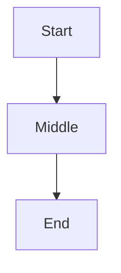
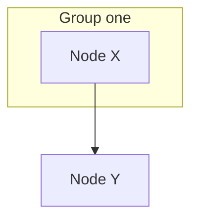
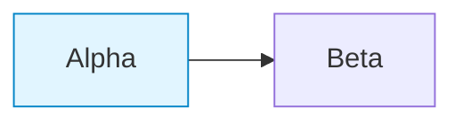
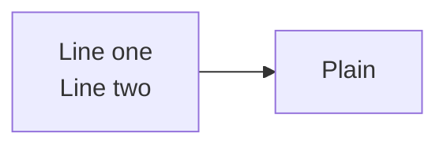

# Mermaid probe

Temporary. Isolates whether GitHub's mermaid renderer works on this repo at
all, versus the architecture diagram's syntax being at fault.

## 1. Minimal graph (no subgraphs, no classDef, no labels on edges)

## 2. Adds a subgraph with a quoted label

## 3. Adds classDef/class

## 4. Adds a br tag inside a label

